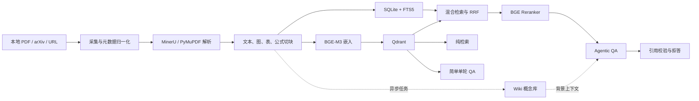

# Paper RAG Agent

面向学术论文的本地 RAG 与 Agentic RAG 后端。项目可以把本地 PDF 或 arXiv
论文转换为可检索的结构化语料，并提供纯检索、简单单轮 QA、Agentic QA、流式
问答和 MCP 工具服务。

当前版本为 `0.1.0.dev0`，适合本地研究、原型验证和二次开发。

## 项目能力

- 多来源论文采集：本地 PDF、arXiv、PDF URL、OpenAlex、Semantic Scholar。
- 双解析后端：优先使用 MinerU 解析复杂版式，失败时可降级到 PyMuPDF。
- 多模态切块：统一处理正文、公式、图和表，并保留页码、章节和资源路径。
- 可选视觉增强：通过 OpenAI 兼容视觉模型为 figure/table 生成摘要并写入检索文本。
- 本地嵌入与精排：BGE-M3 负责中英文向量编码，BGE Reranker 负责交叉编码精排。
- 混合检索：Qdrant 稠密检索 + SQLite FTS5 稀疏检索 + RRF 融合。
- 严格引用：答案只能引用真实证据块，引用格式固定为 `[chunk:<chunk_id>]`。
- Agentic 检索：意图分类、查询改写、多轮检索、反思、证据筛选和拒答判断。
- Wiki 概念库：异步抽取跨论文概念、别名、定义、证据和论文关联。
- MCP 服务：向其他 Agent 或 LangChain 应用暴露结构化证据检索工具。

## 系统架构



核心数据分工：

| 组件 | 用途 |
| --- | --- |
| SQLite | 论文元数据、章节、Chunk、入库状态、Wiki 任务和使用记录 |
| SQLite FTS5 | BM25 风格的中英文稀疏检索 |
| Qdrant | Chunk 和 Wiki 概念的向量检索 |
| BGE-M3 | 查询与文档的多语言稠密向量 |
| BGE Reranker | 对混合召回候选进行交叉编码精排 |
| OpenAI 兼容 LLM | 查询改写、反思、概念抽取和最终作答 |

## 三种主要使用模式

| 模式 | 命令 | 是否调用 LLM | 检索链路 | 适用场景 |
| --- | --- | --- | --- | --- |
| 纯检索 | `scripts/ask.py --no-llm` | 否 | BGE-M3 + Qdrant 稠密检索 | 调试索引、查看原始证据 |
| 简单单轮 QA | `scripts/ask.py` | 是 | 单轮稠密检索 + 一次作答 | 低延迟问答、基线对照 |
| Agentic QA | `scripts/ask.py --agentic` | 是，多阶段 | 改写 + 混合检索 + 精排 + 反思 + 拒答 | 复杂问题、对比分析、综述 |

简单 QA 有意保持为最小 RAG 基线。完整的混合检索、迭代反思和证据充足性判断
位于 Agentic QA 中。

## 环境要求

- Python `3.10` 到 `3.13`。
- [uv](https://docs.astral.sh/uv/) 用于 Python 和依赖管理。
- Docker，用于启动 Qdrant；也可以通过配置使用 embedded Qdrant。
- 可访问 Hugging Face，以便首次运行时下载 BGE-M3 和 Reranker 权重。
- 一个 OpenAI Chat Completions 兼容端点，用于 QA 和 Agentic 链路。
- NVIDIA GPU 非必需，但强烈建议用于嵌入、精排和 MinerU。CPU 可以运行，速度会明显较慢。

模型权重通常需要数 GB 磁盘空间。论文、数据库、模型和运行产物统一写入
`data/`，该目录已被 Git 忽略。

## 从零启动完整功能

以下步骤默认启动当前项目的完整主链路：MinerU 解析、视觉增强、BGE-M3 嵌入、
BGE Reranker、Qdrant、SQLite/FTS5、Wiki 概念库、纯检索、简单 QA、Agentic QA
和 MCP 依赖。只想运行最小功能时再按需删减 extra 或模型配置。

### 1. 克隆项目

在当前项目自己的 GitHub 仓库页面复制 Clone URL，然后执行：

```bash
git clone https://github.com/StrangeMelon/paperRAG.git
cd paperRAG
```

已经位于项目根目录时可以直接从下一步开始。

### 2. 安装 uv

macOS 或 Linux：

```bash
curl -LsSf https://astral.sh/uv/install.sh | sh
```

也可以按照 [uv 官方安装文档](https://docs.astral.sh/uv/getting-started/installation/)
使用 Homebrew、WinGet、Scoop 或 PyPI 安装。

### 3. 安装完整运行依赖

```bash
uv sync \
  --extra dev \
  --extra embed \
  --extra ingest \
  --extra mineru \
  --extra evaluation \
  --extra dashboard \
  --extra mcp \
  --extra deerflow \
  --extra deliver \
  --extra deliver-pdf \
  --extra proactive \
  --extra vision-local
```

这条命令安装完整项目所需的开发工具、嵌入/精排、论文采集、MinerU、评测、
Streamlit 前端、MCP 和全部增强 extra。仅使用在线视觉摘要时可以省略
`vision-local`；`deerflow`、`deliver`、`deliver-pdf`、`proactive` 是可选集成扩展。

依赖组说明：

| Extra | 内容 |
| --- | --- |
| `embed` | BGE-M3、BGE Reranker、Transformers |
| `ingest` | arXiv 客户端、PyMuPDF |
| `mineru` | MinerU OCR 和复杂 PDF 版式解析 |
| `vision-local` | 可选的本地视觉模型后备，不影响在线视觉模型 |
| `mcp` | FastMCP 服务和 LangChain MCP 适配器 |
| `evaluation` | RAGAS、Golden Set 和评测依赖 |
| `dashboard` | Streamlit 前端 |
| `deerflow` | DeerFlow/LangChain 工具适配 |
| `deliver` / `deliver-pdf` | Word、PowerPoint、PDF 交付物 |
| `proactive` | APScheduler 主动任务 |
| `dev` | Pytest、Ruff 等开发工具 |
| `full` | 服务能力聚合依赖；完整启动建议显式安装上面的 extras |

### 4. 下载嵌入、精排和 MinerU 模型

将 BGE-M3 与 BGE Reranker 预下载到项目统一模型缓存：

```bash
mkdir -p data/index/models

uv run python - <<'PY'
from pathlib import Path

from huggingface_hub import snapshot_download

cache_dir = Path("data/index/models").resolve()
models = (
    "BAAI/bge-m3",
    "BAAI/bge-reranker-v2-m3",
)

for model_id in models:
    snapshot = snapshot_download(repo_id=model_id, cache_dir=str(cache_dir))
    print(f"{model_id} -> {snapshot}")
PY
```

下载 MinerU 的布局、阅读顺序和中英文 OCR 权重，并检查运行环境：

```bash
uv run python scripts/download_mineru_models.py
uv run python scripts/mineru_doctor.py --strict
```

下载完成后的主要目录：

```text
data/index/models/         # BGE-M3 与 BGE Reranker Hugging Face 快照
data/index/mineru_models/  # MinerU 布局、LayoutReader 与 OCR 权重
```

项目会优先复用上述本地快照。没有 NVIDIA GPU 时需要把
`config/magic-pdf.json` 的 `device-mode` 调整为可用设备，或者保留
`mineru.fallback_to_pymupdf: true` 让解析失败时降级到 PyMuPDF。

### 5. 配置全部在线模型

创建本地环境文件：

```bash
cp .env.example .env
```

完整功能涉及三组 OpenAI 兼容端点：主 QA 模型、Wiki 专用模型和视觉模型。
下面给出与 `.env.example` 一致的完整配置结构，所有 Key 都必须替换为自己的值：

```dotenv
# 主 QA 模型：简单 QA、Agentic 最终作答、意图、改写和反思
OPENAI_BASE_URL=https://dashscope.aliyuncs.com/compatible-mode/v1
OPENAI_API_KEY=sk-your-dashscope-key
CHAT_MODEL=qwen-plus

# 预留的小模型配置；当前生产 QA 默认仍使用 CHAT_MODEL
SMALL_MODEL=qwen-turbo

# Wiki 概念抽取与词条更新模型
WIKI_LLM_BASE_URL=https://api.deepseek.com
WIKI_LLM_API_KEY=sk-your-deepseek-key
WIKI_LLM_MODEL=deepseek-v4-flash
WIKI_LLM_THINKING=disabled
# WIKI_LLM_REASONING_EFFORT=low

# figure/table 在线视觉摘要模型
VISION_BASE_URL=https://open.bigmodel.cn/api/paas/v4/
VISION_API_KEY=your-zhipu-key
VISION_MODEL=glm-4.6v
```

`scripts/ask.py`、`scripts/ingest_one.py` 和 `scripts/wiki_worker.py` 会自动加载仓库
根目录的 `.env`。真实密钥只能放在 `.env` 中，不要写入 `.env.example` 或
`config/default.yaml`。

模型角色说明：

| 配置 | 当前用途 |
| --- | --- |
| `CHAT_MODEL` | 简单 QA、Agentic 作答、意图分类、查询改写、反思和流式回答 |
| `SMALL_MODEL` | 预留的小模型配置；当前生产链路不会自动切换到它 |
| `WIKI_LLM_MODEL` | 概念抽取、同义概念判断、定义生成和词条更新 |
| `VISION_MODEL` | ingest 阶段的 figure/table 视觉摘要 |

Wiki 专用端点未配置时会回退到主 QA 端点；完整启动建议显式配置，避免 Wiki
批处理与用户问答争抢同一模型配额。不同供应商的 thinking 参数不兼容，修改
端点时同时检查 `config/default.yaml` 中的 `llm.extra_body`、
`wiki.llm.extra_body` 和 `vision.extra_body`。

### 6. 启动 Qdrant

项目默认连接 `http://localhost:6333`。使用 Docker 启动：

```bash
mkdir -p data/qdrant_storage

docker run -d \
  --name paper-rag-qdrant \
  -p 6333:6333 \
  -p 6334:6334 \
  -v "$(pwd)/data/qdrant_storage:/qdrant/storage" \
  qdrant/qdrant
```

检查服务：

```bash
curl http://localhost:6333/collections
```

Qdrant Dashboard 位于 <http://localhost:6333/dashboard>。Docker 参数参考
[Qdrant 官方 Local Quickstart](https://qdrant.tech/documentation/quick-start/)。

容器已经创建但停止时，可以直接恢复：

```bash
docker start paper-rag-qdrant
```

### 7. 初始化数据库和集合

```bash
uv run python scripts/init_store.py
```

该命令会幂等创建：

- `data/index/papers.sqlite`；
- Qdrant 的 `paper_chunks` collection；
- Qdrant 的 `wiki_entries` collection；
- Wiki 所需的 SQLite 表和任务队列。

### 8. 执行 ingest 并构建 Wiki

导入本地 PDF：

```bash
uv run python scripts/ingest_one.py \
  --pdf /absolute/path/to/paper.pdf \
  --title "Paper title"
```

从 arXiv 导入：

```bash
uv run python scripts/ingest_one.py --arxiv 2310.12345
```

强制重建已经完成的论文：

```bash
uv run python scripts/ingest_one.py --arxiv 2310.12345 --force
```

日志中的 `paper_id` 是后续限定检索范围时使用的稳定标识，例如
`arxiv:2310.12345`。不传 `--paper-id` 时会搜索所有已入库论文。

完成第 4 步后，第一次入库会直接复用本地 BGE-M3 和 Reranker 快照；跳过预下载
时才会在首次编码或精排时联网下载。未正确配置 MinerU 时，只要
`mineru.fallback_to_pymupdf: true`，解析器会自动降级到 PyMuPDF。

完整 ingest 的同步阶段包括：采集、PDF 解析、切块、在线视觉摘要、BGE-M3
嵌入、SQLite/FTS5 写入和 Qdrant 索引。论文完成后会把 Wiki 任务持久化入队，
再运行 worker 消费队列：

```bash
uv run python scripts/wiki_worker.py --drain
```

Wiki worker 会执行概念抽取、归一化、合并判断、词条更新，并把 Wiki 向量补偿
同步到 Qdrant。查看队列但只处理一批时使用：

```bash
uv run python scripts/wiki_worker.py --once
```

批量导入一个目录并在结束后构建 Wiki：

```bash
uv run python scripts/ingest_batch.py /absolute/path/to/pdfs
uv run python scripts/wiki_worker.py --drain
```

### 9. 验证纯检索、简单 QA 和 Agentic QA

把 ingest 日志输出的实际 `paper_id` 填入变量：

```bash
PAPER_ID='arxiv:2310.12345'
```

纯检索，不调用在线 LLM：

```bash
uv run python scripts/ask.py \
  "这篇论文的主要贡献是什么？" \
  --paper-id "$PAPER_ID" \
  --top-k 5 \
  --no-llm
```

简单单轮 QA：

```bash
uv run python scripts/ask.py \
  "这篇论文的主要贡献是什么？" \
  --paper-id "$PAPER_ID" \
  --top-k 8
```

完整 Agentic QA：

```bash
uv run python scripts/ask.py \
  "比较这篇论文的方法、实验结果和主要局限" \
  --paper-id "$PAPER_ID" \
  --agentic
```

执行到这里后，完整链路已经启动：本地解析和检索模型负责建立证据库，视觉模型
增强图表文本，Wiki worker 建立跨论文概念背景，主 QA 模型负责查询规划与回答，
Agentic QA 负责多轮检索、反思、证据筛选和拒答。

### 10. 启动 Streamlit 前端

保持 Qdrant 运行；若还需继续处理新入库论文的 Wiki 任务，让 Wiki worker 在另一个
终端运行。最后启动前端：

```bash
uv run python scripts/start_dashboard.py --address 127.0.0.1 --port 8501
```

浏览器打开 [http://127.0.0.1:8501](http://127.0.0.1:8501)。局域网访问时可以改用
`--address 0.0.0.0`，但必须自行增加防火墙、反向代理和身份认证。

前端包含四个完整页面：

* 问答工作台：Agentic、Simple、Stream 三种模式，论文范围、引用、证据和 trace。
* 数据浏览：上传 PDF 入库，浏览论文、Chunk、图表、Wiki，预览并级联删除论文。
* 管道监控：入库与检索阶段耗时、检索诊断、候选变化和历史查询。
* 评测面板：Custom、RAGAS、Composite QA 评测与纯检索 Golden Set。

执行到这里，完整项目已经以可交互前端启动。

## 使用项目

### 纯检索，不调用 LLM

```bash
uv run python scripts/ask.py \
  "这篇论文的主要贡献是什么？" \
  --paper-id arxiv:2310.12345 \
  --top-k 5 \
  --no-llm
```

该 CLI 模式执行 BGE-M3 查询编码和 Qdrant 稠密检索，输出证据 Chunk，不生成
答案，也不消耗 LLM Token。适合验证入库结果、过滤范围和召回质量。

通过 Python 调用同一能力：

```python
from paper_rag.retrieve.dense import retrieve

chunks = retrieve(
    "What is the main contribution?",
    top_k=5,
    paper_ids=["arxiv:2310.12345"],
)

for chunk in chunks:
    print(chunk["chunk_id"], chunk.get("score"), chunk["text"][:200])
```

需要完整的“查询改写 + 混合召回 + 精排 + 论文多样化”检索，但不生成最终答案时：

```python
from paper_rag.retrieve.pipeline import retrieve_round

chunks = retrieve_round(
    "比较论文中的方法与基线模型",
    paper_ids=["arxiv:2310.12345"],
    top_k=8,
)
```

`retrieve_round` 的查询改写阶段可能调用 LLM，但不会执行最终答案生成。

### 简单单轮 QA

```bash
uv run python scripts/ask.py \
  "这篇论文使用了哪些数据集？" \
  --paper-id arxiv:2310.12345 \
  --top-k 8
```

简单 QA 的处理流程是：

```text
问题 -> 单轮稠密检索 -> 格式化证据 -> LLM 作答 -> 引用校验
```

输出包括：

- `ANSWER`：只基于检索证据生成的答案；
- `CITATIONS`：通过校验的 `[chunk:<chunk_id>]` 引用；
- 可疑数字引用或作者年份引用会被检测并清理。

Python API：

```python
from paper_rag.rag.qa_simple import answer

result = answer(
    "What datasets are used in the experiments?",
    top_k=8,
    paper_ids=["arxiv:2310.12345"],
)

print(result["answer"])
print(result["citations"])
```

### Agentic QA

```bash
uv run python scripts/ask.py \
  "比较这篇论文的方法、实验结果和主要局限" \
  --paper-id arxiv:2310.12345 \
  --agentic
```

Agentic QA 的主要阶段：

1. 校验 `paper_id` 范围和访问权限；
2. 解析可用的 Wiki 概念背景；
3. 判断问题属于事实、推理还是探索型意图；
4. 生成稠密检索改写和 BM25 关键词；
5. 执行 Qdrant + FTS5 混合检索与 RRF 融合；
6. 使用 BGE Reranker 精排，并限制单篇论文占据过多结果；
7. 反思当前证据是否足够，必要时改写问题并继续检索；
8. 根据证据分数执行 `confident`、`weak_evidence` 或 `no_evidence` 判断；
9. 只把选中的证据交给 LLM 作答，并校验所有引用。

CLI 会额外输出 TRACE 摘要，包括意图、迭代次数、停止原因、拒答决策和耗时。
当证据明显不足时，Agentic QA 会在最终作答之前停止，不让 LLM 根据噪声编造答案。

Python API：

```python
from paper_rag.rag.qa_agentic import answer

result = answer(
    "Compare the method, experiments, and limitations.",
    paper_ids=["arxiv:2310.12345"],
)

print(result["answer"])
print(result["citations"])
print(result["trace"]["stopped_by"])
print(result["trace"]["abstain"])
```

### 流式 Agentic QA

```bash
uv run python scripts/ask.py \
  "逐步解释论文的方法" \
  --paper-id arxiv:2310.12345 \
  --stream
```

流式模式会依次输出 intent、rewrite、retrieved、reflect、abstain、answer_chunk
和 done 事件。

### 限定多篇论文

`--paper-id` 可以重复传递：

```bash
uv run python scripts/ask.py \
  "比较两篇论文的检索增强方法" \
  --paper-id arxiv:2310.12345 \
  --paper-id arxiv:2401.01234 \
  --agentic
```

## 批量导入论文

预览目录中的 PDF：

```bash
uv run python scripts/ingest_batch.py /absolute/path/to/pdfs --dry-run
```

先试运行前三篇：

```bash
uv run python scripts/ingest_batch.py /absolute/path/to/pdfs --limit 3
```

导入整个目录：

```bash
uv run python scripts/ingest_batch.py /absolute/path/to/pdfs
```

批量任务逐篇隔离失败、支持断点续跑，并把报告写入
`data/ingest_batch_report.json`。目录扫描只处理当前层级，不递归子目录。

## 组件运维与扩展

### MinerU 诊断与重装

安装依赖并下载项目固定版本的最小双语权重：

```bash
uv sync --extra dev --extra embed --extra ingest --extra mineru
uv run python scripts/download_mineru_models.py
uv run python scripts/mineru_doctor.py --strict
```

默认配置位于 `config/magic-pdf.json`。其中 `device-mode` 默认为 `cuda`；没有
CUDA 时可以继续使用 PyMuPDF 降级路径。

### 视觉摘要

在 `.env` 中配置：

```dotenv
VISION_BASE_URL=https://your-vision-endpoint/v1
VISION_API_KEY=your-vision-key
VISION_MODEL=your-vision-model
```

视觉增强只处理 figure/table Chunk，支持并发调用、缓存和失败时保留原始文本。
详细参数位于 `config/default.yaml` 的 `vision` 节。

### Wiki 概念库

每篇论文完成入库后只会写入持久化任务队列，不会在入库主链路同步调用 Wiki LLM。
处理队列：

```bash
# 处理一批后退出
uv run python scripts/wiki_worker.py --once

# 持续处理直到队列排空
uv run python scripts/wiki_worker.py --drain
```

Wiki 可以复用全局 LLM，也可以通过 `WIKI_LLM_BASE_URL`、`WIKI_LLM_API_KEY`、
`WIKI_LLM_MODEL` 和 `WIKI_LLM_THINKING` 使用独立端点。Wiki 内容只作为查询改写
和背景上下文，不能替代论文 Chunk 作为事实引用。

### MCP Server

安装 MCP extra：

```bash
uv sync --extra embed --extra ingest --extra mcp
```

启动 stdio 服务：

```bash
uv run --extra mcp paper-rag-mcp
```

默认 profile 暴露 `paper_retrieve_evidence`。管理员 profile 额外暴露短期检索
trace 工具：

```bash
uv run --extra mcp paper-rag-mcp --profile admin
```

LangChain MCP 适配示例：

```python
from langchain_mcp_adapters.client import MultiServerMCPClient

client = MultiServerMCPClient(
    {
        "paper-rag": {
            "transport": "stdio",
            "command": "uv",
            "args": ["run", "--extra", "mcp", "paper-rag-mcp"],
        }
    }
)

tools = await client.get_tools()
```

### 增量入库

同一论文再次以 --force 入库时，系统按 chunk fingerprint 只更新变化的向量和载荷，删除已移除 chunk，并同步维护 SQLite、FTS5 和 Qdrant，不会整篇重建。

```bash
uv run python scripts/ingest_batch.py /absolute/path/to/pdfs --force
uv run python scripts/accept_incremental_ingest.py
```

要同时强制验证 MinerU、在线 Vision、嵌入、Qdrant 更新和视觉缓存，运行 `scripts/accept_full_incremental_ingest.py`。两个验收脚本都使用隔离目录，不会清理生产数据。

### 评测与质量门禁

Custom 和纯检索评测不需要额外 judge；RAGAS 需要 `.env` 中的 RAGAS_* 配置。默认 Golden Set 位于 `tests/fixtures/evaluation/`。

```bash
uv run python scripts/evaluate.py --backend custom --test-set tests/fixtures/evaluation/golden.json
uv run python scripts/evaluate.py --mode retrieval --backend custom --test-set tests/fixtures/evaluation/retrieval_golden.json
uv run python scripts/evaluate.py --backend ragas --test-set tests/fixtures/evaluation/ragas_golden.json --max-concurrency 4
uv run python scripts/evaluate.py --backend composite --test-set tests/fixtures/evaluation/golden.json
```

RAGAS 报告默认写入 `data/evaluation/ragas-<timestamp>.json`；可用 `--compare-baseline` 和 `--max-regression` 做回归门禁。前端评测面板会把运行结果追加到 `data/dashboard/evaluation_history.jsonl`。

## 配置说明

默认配置文件是 `config/default.yaml`。配置文件优先级：

1. Python 调用 `config.load(path)` 时显式传入的路径；
2. 环境变量 `PAPER_RAG_CONFIG`；
3. `config/default.yaml`。

配置加载器会把 `$ENV_VAR` 形式的值替换为环境变量，并把以 `./` 开头的路径
解析为相对于仓库根目录的绝对路径。自定义配置文件需要包含完整配置，不会自动
与 `default.yaml` 做深度合并。

常用参数：

| 配置路径 | 含义 |
| --- | --- |
| `embedding.device` | `auto`、`cpu` 或 `cuda` |
| `qdrant.url` | Qdrant HTTP 地址 |
| `qdrant.local_path` | 设置后使用 embedded Qdrant，不连接 Docker 服务 |
| `mineru.fallback_to_pymupdf` | MinerU 失败时是否自动降级 |
| `retrieve.sparse_backend` | `fts5` 或 `rank_bm25` |
| `rag.intent.*` | 不同问题意图的 top-k 和最大迭代次数 |
| `rag.abstain.*` | Agentic QA 的拒答阈值 |
| `vision.max_concurrency` | 单篇论文视觉请求并发数 |
| `wiki.worker.concurrency` | Wiki worker 同时处理的论文数 |

## 项目结构

```text
paper-rag-agent/
├── config/                  # 默认配置与 MinerU 配置
├── scripts/                 # 初始化、入库、问答、worker 和真实演示入口
├── src/paper_rag/
│   ├── ingest/              # 论文来源与元数据归一化
│   ├── parse/               # MinerU / PyMuPDF 解析
│   ├── chunk/               # 文本与多模态切块
│   ├── embed/               # BGE-M3 嵌入
│   ├── store/               # SQLite、Qdrant、入库流水线
│   ├── retrieve/            # 稠密、稀疏、混合检索与精排
│   ├── rag/                 # 简单 QA、Agentic QA、流式 QA
│   ├── vision/              # 图表视觉摘要
│   ├── wiki/                # 概念库、队列与一致性管理
│   ├── mcp/                 # MCP server、schema、运行时和 trace
│   └── observability/       # 指标与 trace
└── tests/                   # 单元、边界和真实集成测试
```

## 开发与验证

```bash
# 非真实测试
uv run pytest -q --ignore-glob='tests/test_*_real.py'

# 全量测试；部分真实测试要求本地模型、PDF、API 或 Qdrant
uv run pytest -q

# 代码检查
uv run ruff check .
uv run ruff format --check .

# 构建 wheel 和源码包
uv build

# Streamlit 前端真实渲染验收
uv run python scripts/accept_dashboard.py

# 其他增强能力验收
uv run python scripts/accept_evaluation.py
uv run python scripts/accept_mcp_runtime.py
uv run python scripts/accept_mcp_scope.py
```

## 常见问题

### 无法连接 Qdrant

确认容器和端口：

```bash
docker ps --filter name=paper-rag-qdrant
curl http://localhost:6333/collections
```

如果服务运行在其他机器，修改 `qdrant.url`。

### 第一次检索非常慢

第一次检索需要下载并加载 BGE-M3；Agentic QA 还会加载 BGE Reranker。后续进程
仍需加载模型，但不再重复下载权重。GPU 能显著缩短编码和精排时间。

### MinerU 失败

运行：

```bash
uv run python scripts/mineru_doctor.py --strict
```

检查 CLI、配置、模型目录和 CUDA。只需要快速跑通文本 PDF 时，可以依赖默认的
PyMuPDF 降级路径。

### LLM 返回 400 或 thinking 参数错误

不同 OpenAI 兼容供应商的私有参数不同。可以在本地配置的 `llm.extra_body`、
`wiki.llm.extra_body` 或 `vision.extra_body` 中设置供应商参数。不要把某个供应商
的 `thinking` 或 `enable_thinking` 参数直接用于另一个供应商。

### Agentic QA 返回 no_evidence

这表示检索结果低于 `rag.abstain.threshold_low`，系统主动跳过最终 LLM 作答。
先使用 `--no-llm` 检查入库内容和 `paper_id` 范围，再根据自己的评测集校准
`rag.abstain` 阈值，不建议仅为了得到答案而直接关闭拒答。

## 安全与数据

- 不要提交 `.env`、API Key、PDF、数据库、模型权重或 `data/` 运行产物。
- `.env.example` 只能保留占位符。
- 对外暴露 MCP 服务时，应提供真实的租户和用户身份，并限制 admin profile。
- 论文和模型可能受各自许可证约束，使用者需要自行确认数据与模型授权。

## License

MIT License。
